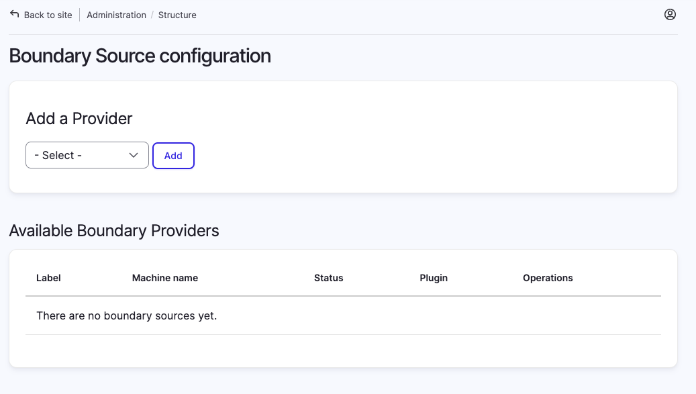
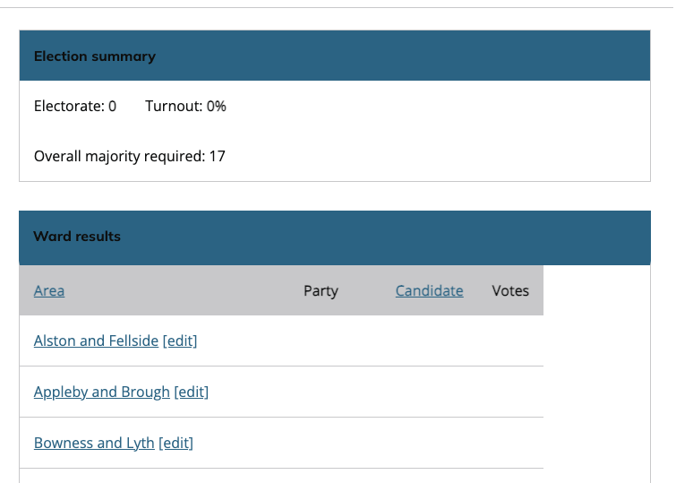
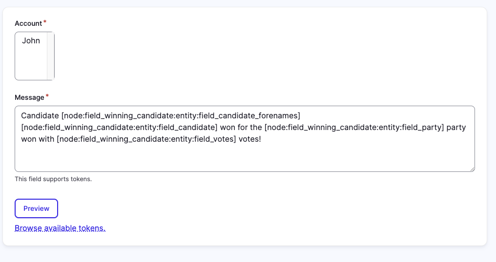

# Documentation

## Contents

- [Preparing for an election](#preparing-for-an-election)
  - [Add a boundary source](#add-a-boundary-source)
  - [Add Parties](#add-parties)
  - [Create an election](#create-an-election)
  - [Add candidate and electoral area details](#add-candidate-and-electoral-area-details)
  - [A not 'all-out' election](#a-not-all-out-election)
- [Running an election](#running-an-election)
  - [Entering electoral area results](#entering-electoral-area-results)
  - [Tweet the result](#tweet-the-result)

## Preparing for an election

The steps to prepare for an election are as follows:

- Add a boundary source (optional)
- Add terms to Party taxonomy
- Create an election
- Add the candidate and electoral area details

### Add a boundary source

> NOTE: You can skip this step if you don't plan to use the mapping and/or have a small number of electoral areas and are happy to enter them manually.

1. Go to `Structure > Boundary Sources` or `/admin/structure/boundary-source`.
2. The available providers will be shown in the "Add a Provider" section. 
3. Select the provider you wish to use from the dropdown and click "Add",
4. Give the Boundary source a label and complete any other required fields. Each provider should provide documentation as to what the fields are.
5. Click Save.

#### Creating a Boundary Provider

If you are interested in writing your own boundary provider plugin, you can read more in
[providers.md](providers.md).

### Add Parties

1. Go to ` Structure > Taxonomy > Party` or `/admin/structure/taxonomy/manage/party/overview`
2. Click Add term
3. Complete the form for each party represented in the Election. Examples are:
   - Name: Labour; Abbreviation: LAB; Party colour: 228,13,59; Opacity: 0; Text colour: 250,250,250; Opacity: 1;
   - Name: Conservative; Abbreviation: CON; Party colour: 1,174,239; Opacity: 0; Text colour: 0,0,0; Opacity: 1;
   - NOTE: Ensure that the text colour and Party colour have enough contrast to be accessible
   - See [more parties and their colours](https://docs.google.com/spreadsheets/d/161Df7tQFZrKhVPAy4vCT19RoDXl2dAsqOWRdOkNInp4/edit#gid=0) (not tested for accessibility)

### Create an election

1. Go to `Content > Add content > Election` or `/node/add/election`
2. Add in the required details.
3. **Map Display**: If you are manually adding electoral areas or don't wish to show the map toggle the `Display map` slider from the default `on` to  `off`
3. **Majority Display**: If you you are reporting on a sub-set of an election e.g. a Council reporting on the UK Westminster constituencies in their area then toggle the `Display majority details` slider from the default `on` to `off`
4. Click Save.

#### Using a boundary source to create electoral areas
1. After clicking Save in step 4 above, the tabs for view, edit, delete etc contains a tab for `Add areas`, click that.
5. If you have more than one Boundary Source configured, select the one you wish to use.
6. Now select the Areas you wish in the election. NOTE if preparing for an election which is only electing a proportion of seats you need to select all seats not just those being contested.
7. Click Fetch.

#### Manually creating electoral areas
For each electoral area you need, do the following:
1. Go to `Content > Add content > Areas vote` or `/node/add/division_vote`
2. Add the Title and Area name. You can also [Add candidate and electoral area details](#add-candidate-and-electoral-area-details) at the same time if you wish.
3. Expand the `References` dropdown and using auto-completed select the election this area is being used in.
4. Click Save.

### Add candidate and electoral area details

1. On viewing the election node you will be presented with a list of electoral area results. Use the `[edit]` link to access each electoral area details.   

2. You need to add the following details for each electoral area in the preparation stage
   1. Details tab - Eligible voters
   2. Candidates and Votes - Candidates (see below) and PDF list of candidates (optional)
   3. Previous election details (optional)

#### Adding a candidate

1. In the Candidates and Votes tab, click the Add Candidate button
2. Complete all the details on the form except Votes in the Result section.
3. Repeat for all candidates in the electoral area

### A not 'all-out' election

If you are preparing for an election which is not 'all out' and only elects a proportion of seats then when adding electoral area details you need to click the 'Seat not contested' slider for the electoral areas which are not being contested this time. You will also need to add the details of the incumbant 'candidate'. This is so majority calculations still work.

## Running an election

Once the results from the count start to come in you can enter them from viewing the election node. 

### Entering electoral area results

1. In the list of electoral areas on the election node view click `[edit]` for the electoral area concerned.
2. For each candidate listed, click the Edit button and enter the number of votes they received.
3. Click the 'Votes finalised' slider to confirm this result is declared.
4. In the Overall results tab enter the number of spoils and whether it was a Hold or Gain for the winning party.
5. Click Save or Save and Tweet (if you have enabled the submodule and wish to post the result to social media)

### Tweet the result

The module will need configured before use. Please see the submodule [documentation](../modules/localgov_election_reporting_social_post/README.md) for instructions.

1. Having followed the process for [Entering electoral area results](#entering-electoral-area-results) you click Save and Tweet.
2. You are then presented with a screen to select the account (as setup in submodule [documentation](../modules/localgov_election_reporting_social_post/README.md)) and the message to tweet. This supports tokens. 
3. Click Preview
4. You can them Edit or Tweet.
